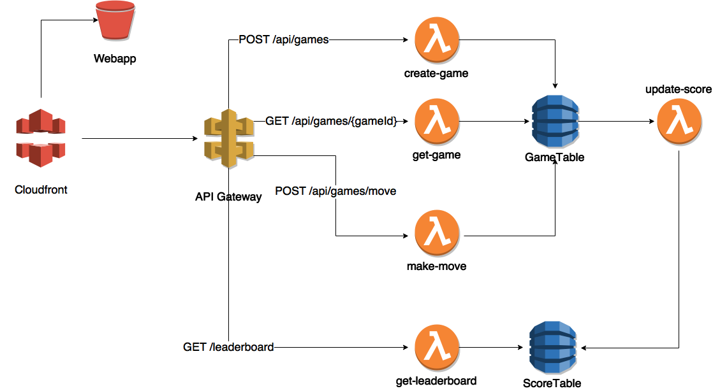

# Going Serverless - workshop

A workshop on how to implement a serverless application on AWS. In this workshop you will learn how to implement the following:

* Managing infrastructure as code with [AWS Cloudformation](https://aws.amazon.com/cloudformation/) together with [AWS SAM](https://github.com/awslabs/serverless-application-model)
* Developing [AWS Lamda](https://aws.amazon.com/lambda/details/)
* Working with [Amazon DynamoDB](https://aws.amazon.com/dynamodb/)


## Goal

To implement a Rock Paper Scissors game with the following resources:




## Prerequisites

### Tools

Make sure that the followig software is installed and configured:

* A posix compatible terminal
* node.js
* [AWS CLI](https://aws.amazon.com/cli/)


### Configuring your AWS Account

We will work a lot with CloudFormation in this lab, as the templates that you will be deploying will create and update [IAM](http://docs.aws.amazon.com/IAM/latest/UserGuide/introduction.html) resources you will need to make sure that you have a user that has IAM access rights.

The scripts that we will be using need to be able to use the [AWS CLI](https://aws.amazon.com/cli/), so please make sure you have it installed and configured. If you are running on mac you can install in with homebrew (`brew install awscli`)

Once the [AWS CLI](https://aws.amazon.com/cli/) is installed the next step is to make sure the [AWS CLI](https://aws.amazon.com/cli/) is configured. To configure the CLI have a look at the [AWS documentation](http://docs.aws.amazon.com/cli/latest/userguide/cli-chap-getting-started.html).

When we have our user the second step is to create an S3 bucket. It will be used to store your Serverless infrastructure and resources as part of the deployment. You can use either the AWS Console or the AWS CLI to create the bucket:

```
./scripts/create-bucket.sh --bucket <bucket-name>
```

## Deployments

### API Stack

Now that we have the tool configuration in place, it is time to start the workshop. The first thing that we'll do is to deploy the application. To deploy a SAM template there are two necessary steps. The stack has to be packaged, i.e. we will upload the code to an Amazon S3 bucket. This will be done with the AWS command [aws cloudformation package](http://docs.aws.amazon.com/cli/latest/reference/cloudformation/package.html). Once the stack has been packaged you will notice a new file named  `api.sam.output.yaml`. That is the file that we will later deploy. This will done with the AWS command [aws cloudformation deploy](http://docs.aws.amazon.com/cli/latest/reference/cloudformation/deploy/index.html).

To simplify the above process we have combined those two commands into one script:

```
./scripts/deploy-api.sh --api-stack-name <api-stack-name> --bucket <bucket-name>
```

This scripts does everything and will also test your stack and give you the url to your api. But if you want to do the deployment totally manual you could do it with just the following two commands:

```
aws cloudformation package \
    --template-file api.sam.yaml \
    --s3-bucket <bucket-name> \
    --output-template-file api.sam.output.yaml

aws cloudformation deploy \
    --stack-name <your-stack> \
    --template-file api.sam.output.yaml \
    --capabilities CAPABILITY_NAMED_IAM
```

When you deployed the stack you also might noticed the HTTP commands that was done towards the API and tested the stack. You can run the commands without deploying your stack by running:

```
./scripts/test-stack.sh --api-stack-name <api-stack-name>
```

For more reference on how to test the stack you could have a look at [Rock Paper Scissors API documentation](docs/rest-api.md).


### Web Stack

We will also deploy the static web application now. Since we want to avoid messing with CORS in this lab we will put both the web and the API behind a CloudFront distribution, i.e. CDN hosted by AWS. The CloudFront distribution can take anywhere between 10 to 30 minutes to provision, so we might as well do it now:

```
./scripts/deploy-web.sh \
  --api-stack-name <api-stack-name> \
  --web-stack-name <web-stack-name>
```

This script will provision a CloudFront distribution, set up one origin with path mapping `/api/*` towards our API Gateway while all other requests will be directed to our S3 bucket where we will upload our Web app. When finished, you can visit the web site if you copy / paste the URL presented in the terminal to a browser:

```
#################################################################
Deployed CDN to https://[cloud front distribution].cloudfront.net
#################################################################
```


## Game Rules

- Each game needs to be created with a unique `gameId`. As a result, the game state will be `CREATED`.
- A player can make a move by specifying: 
    - A `playerId`
    - A `gameId`
    - A `move` (i.e. `ROCK`, `PAPER` or `SCISSORS`)
- After the first move, the game state will be `FIRST_MOVE`.
- The game is finished after two moves have been made. Either the game state is `WINNER` or `DRAW`.
- The winner of a game will receive a score of `10`. There is no points in case the game was a draw.
- A game only consists of one round. If you would like to play the same opponents again, you need to create a new game.
- The leaderboard will present the accumulated score of all players that have a a score.
 


## Lab Instructions

When following the instructions you are going to implement the API for the rock paper scissors game. Below you can see reference documentation for the api and dynamodb structures that we will be using.

| Document                                              | Description                           |
| ----------------------------------------------------- | ------------------------------------- | 
| [docs/rest-api.md](docs/rest-api.md)                  | Rock Paper Scissors REST API          |
| [docs/dynamodb-tables.md](docs/dynamodb-tables.md)    | Rock Paper Scissors DynamoDB schema   |
| [docs/references.md](docs/references.md)              | Links to the AWS developer guides     |


### Create Game

To get started in with the first lambda, head to the instructions at in [lambdas/create-game/instructions.md](lambdas/create-game/instructions.md).


### Get Game

After creating a game, we need some way of querying its current state. For this reason, follow the steps in [lambdas/get-game/instructions.md](lambdas/get-game/instructions.md).


### Make Move

To take part in a game, the players need to make a move. Head to the instructions at in [lambdas/make-move/instructions.md](lambdas/make-move/instructions.md) to see what you need to do.


### Update Score

To get started with calculating the score we will create a lambda that works on a DynamoDB stream from our `GameTable`. To get started, follow the instructions at [lambdas/update-score/instructions.md](lambdas/update-score/instructions.md)


### Get Leaderboard

Once we have calculated our score we are going to have to build an API for the client. To continue with this, follow the instructions at [lambdas/get-leaderboard/instructions.md](lambdas/get-leaderboard/instructions.md)


## Clean up

If you would like to delete all your AWS resources after you have finished the workshop, you can use the `delete-stack.sh` script, e.g.

```
./scripts/delete-stack.sh --web-stack-name <web-stack-name> --api-stack-name <api-stack-name> --bucket <bucket-name>
```
